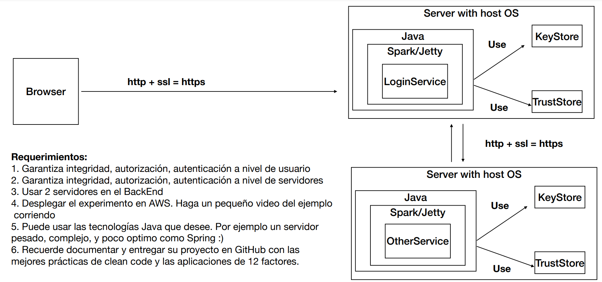

# Taller de All Secure Spark

Este taller consiste en el desarrollo de una aplicacion Web segura que cumple con los siguientes requerimientos:
1. Permitir un acceso seguro desde browser a la app. Garantizando autenticación, autorizacion e integridad de usuarios.
2. Dos servidores comunicandose entre ellos y el acceso remoto garantizando: autenticacion, autorizacion e integridad entre los servicios

## Comenzando 🚀

Se presentaran un conjunto de instrucciones para que este pueda tener un funcionamiento correcto en maquina local.

Mira **Deployment** para conocer como desplegar el proyecto.


### Pre-requisitos 📋

Para un optimo funcionamiento del proyecto en un ambiente de desarrollo se debe contar con los siguientes Apps instaladas y configuradas (en el caso de Java y Maven):

- [Java](https://www.java.com/es/download/ie_manual.jsp) : Lenguaje y entorno de desarrollo.
- [Maven](https://maven.apache.org/) : Gestor de dependencias.
- [Spark](https://sparkjava.com/download) : Micro-framework para desarrollo web.
- [Git](https://git-scm.com/) : Software para control de versiones.
- [AWS](https://aws.amazon.com) : Servicio de despliegue.
### Instalación 🔧

Para esto se puede utilizar cualquier shell que prefiera.

1. ***Clonar el proyecto***
    ```
    git clone https://github.com/luis-amaya/AREP-TallerAllSecureSpark.git
    ```

2. ***Compilar el proyecto***
   ````
   mvn clean install
   ````
3. ***Ejecutar los archivos***
    ````
   ejecutar los archivos HelloService.java de securityprimerlive y securityservice
   ````

## Arquitectura 🚧


En esta arquitectura se tienen dos servidores cada uno con dos llaves (KeyStore y TrustSore), mediante las cuales se asegura una coneccion segura entre servidores y browser. 
En el servicio LoginService, en este caso estan distribuidos en las clases, HelloService, SecureContext y URLReader se tienen las utenticaciones de usuario, teniendo un usuario y una clave determinados, los cuales estan "quemados" dentro del codigo, los cuales son analizados por el SecureContext, comparandolos con los datos ingresados en el login(index.html). Una vez autenticado se comunica con el otro servidor, que en este caso de hacer una conexion segura devolvera un JSON. La conexion y comunicacion con el otro servidor se realiza mediante URLReader, en donde se utiliza la clave del servidor para realizar la comunicacion entre seidores y asi garantizar una seguridad tanto entre servidores como a nivel de usuario.

### Como escalar la arquitectura.

En este prototipo se tienen las claves guardadas dentro de un hashmap, cifradas mediante SHA256. Esta arquitectura se puede escalar de manera que los usuarios y sus contraseñas se encuentren almacenados dentro de una base de datos en un servidor, donde las contraseñas se encuentren cifradas y simplemente al momento de realizar un login se realice un hash de la contraseña ingresada y mediante el usuario se confirme: 1. si en la base de datos existe un usuario con ese 'nombre' y 2. Si la contraseña cifrada dentro de la base de datos es la misma que se ingreso y se cifro posteriormente.

Los servicios que se pueden ofrecer en cada uno de los servidores se pueden escalar para tener aplicaciones mas robustas, ya que la seguridad está 'garantizada' en este prototipo.
### 12 Factores 
Es un marco para construir aplicaciones de software como servicio, en donde se definieron los siguientes factores al momenbto de realizar una app web segura.

1. Código base (Codebase)
Un código base sobre el que hacer el control de versiones y multiples despliegues
2. Dependencias
Declarar y aislar explícitamente las dependencias
3. Configuraciones
Guardar la configuración en el entorno
4. Backing services
Tratar a los “backing services” como recursos conectables
5. Construir, desplegar, ejecutar
Separar completamente la etapa de construcción de la etapa de ejecución
6. Procesos
Ejecutar la aplicación como uno o más procesos sin estado
7. Asignación de puertos
Publicar servicios mediante asignación de puertos
8. Concurrencia
Escalar mediante el modelo de procesos
9. Desechabilidad
Hacer el sistema más robusto intentando conseguir inicios rápidos y finalizaciones seguras
10. Paridad en desarrollo y producción
Mantener desarrollo, preproducción y producción tan parecidos como sea posible
11. Historiales
Tratar los historiales como una transmisión de eventos
12. Administración de procesos
Ejecutar las tareas de gestión/administración como procesos que solo se ejecutan una vez
## Construido con 🛠️
Proyecto construido con:

* [Spark](https://sparkjava.com/download) - El framework web usado
* [Maven](https://maven.apache.org/) - Manejador de dependencias


## Video
Para ver el video, descargar el archivo [Video.mp4](Video.mp4)
## Autores ✒️

***Luis Gerardo Amaya Ortiz***

## Licencia 📄

Este proyecto está bajo la Licencia (Tu Licencia) - mira el archivo [LICENSE](License.md) para detalles


Plantilla de README por: [Villanuevand](https://github.com/Villanuevand) 
